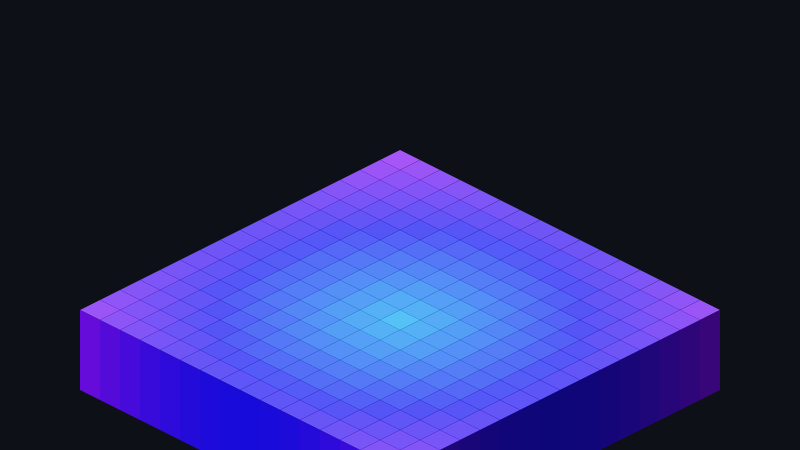

<div align="center">
  <picture>
    <source media="(prefers-color-scheme: dark)" srcset="mesmerizing.svg">
    
  </picture>
</div>

```console
oz456@github:~$ ./boot --matrix
[+] Initializing neural architecture...
[+] Rendering 3D spatial grid...
[+] Status: Optimal.
```
